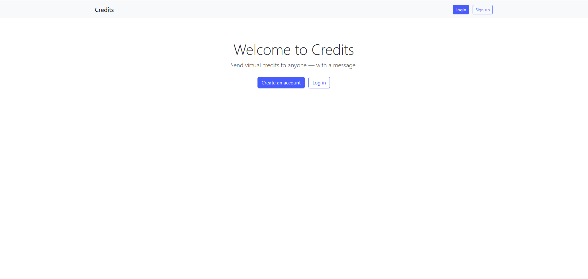
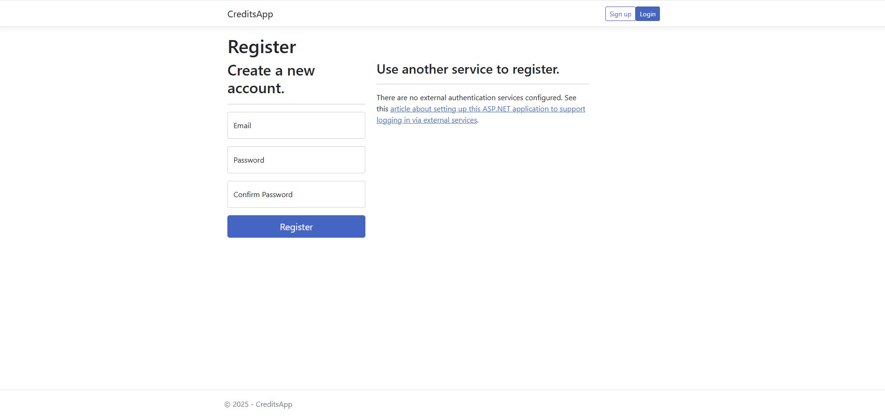
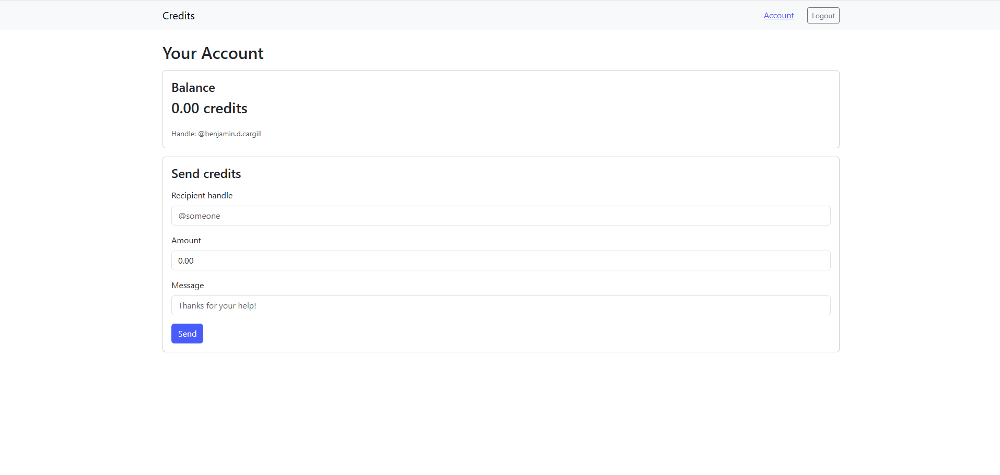
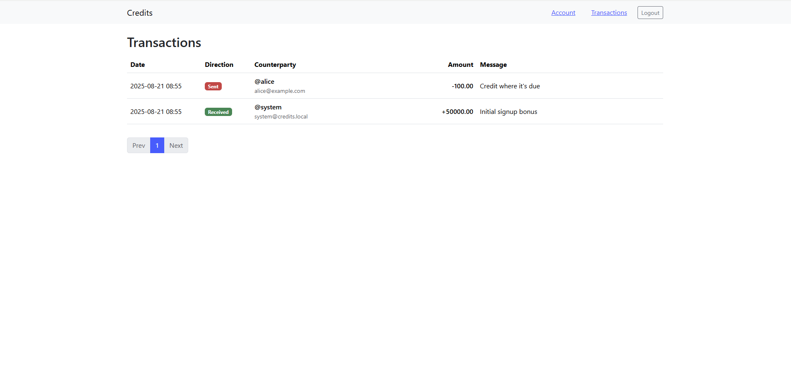

# CreditsApp

Send virtual credits to anyone.






---

## Features

- **User accounts & auth** via ASP.NET Core Identity (cookie auth)
- **Double-entry ledger** (no mutable balances)
- **Send credits** to another user with an optional message
- **Idempotent transfers** (safe to retry)
- **SQLite** by default (easy local/dev), migrations included
- **Swagger UI** for the transfer API

---

## Quick start (local)

Requirements: **.NET 8 SDK**

```bash
# from repo root
dotnet restore

# create/update the local SQLite db
dotnet ef database update --project CreditsApp

# run the app (HTTP)
dotnet run --project CreditsApp --urls "http://localhost:8080"
```

Open:
- App UI: http://localhost:8080  
- API docs: http://localhost:8080/swagger

> Prefer HTTPS locally?  
> ```bash
> dotnet dev-certs https --trust
> dotnet run --project CreditsApp --urls "http://localhost:8080;https://localhost:8081"
> ```
> Then browse https://localhost:8081

---

## What you can do

- **Register & Login** (Identity UI):
  - `/Identity/Account/Register`
  - `/Identity/Account/Login`
- **Account dashboard**: `/Account`
  - See **balance**
  - Send **credits + message** to `@handle`
- **API** (example):
  - `POST /api/transfers`
    ```json
    {
      "toHandle": "@bob",
      "amount": 25.50,
      "message": "cheers!",
      "idempotencyKey": "any-unique-string"
    }
    ```

---

## Architecture (short)

- **Identity user (`AppUser`)** ←→ **Account** (1:1)
- **Transfer** creates two **LedgerEntry** rows:
  - **Debit** sender’s account
  - **Credit** recipient’s account
- **Balance** = sum(credits) − sum(debits) (computed query)

This model is auditable and makes refunds/adjustments easy (append entries; don’t mutate balances).

---

##  Project structure

```
CreditsApp/
  Data/
    AppDbContext.cs
    AppUser.cs
    Account.cs
    LedgerEntry.cs
    Transfer.cs
    TransferService.cs
    Seed.cs
  Migrations/               # EF Core migrations
  Pages/                    # Razor Pages UI
    Account/Index.cshtml    # Account dashboard (balance + transfer)
    Shared/_Layout.cshtml   # Navbar + bootstrap
    Shared/_LoginPartial.cshtml
    _ViewImports.cshtml
    _ViewStart.cshtml
    Index.cshtml            # Landing page
  Demo/
    Landing.png
    Login.png
    Transfer.png
  Program.cs
  appsettings.json
  README.md
```

---

##  Configuration

**SQLite connection string**

- Default (dev): `Data Source=./data/credits.db`
- Override via env var:
  - PowerShell:  
    `setx ConnectionStrings__Default "Data Source=./data/credits.db"`
  - Docker (compose):  
    `ConnectionStrings__Default=Data Source=/app/data/credits.db`

**Do not commit local DB files.** Add to `.gitignore`:
```
# SQLite local database
*.db
*.db-shm
*.db-wal
```

---

## Docker (optional)

Example `docker-compose.yml`:

```yaml
version: "3.9"
services:
  api:
    build:
      context: ./CreditsApp
      dockerfile: Dockerfile
    environment:
      - ASPNETCORE_ENVIRONMENT=Development
      - ConnectionStrings__Default=Data Source=/app/data/credits.db
    ports:
      - "8080:8080"
    volumes:
      - api_data:/app/data
volumes:
  api_data:
```

Run:
```bash
docker compose up --build
# Open http://localhost:8080
```

---

## Security & safety notes

- This is **virtual credits** only; if you ever accept **real money**, integrate a PSP (e.g., Stripe) and treat deposits as a credit from a **system treasury account** on webhook success.
- Add **rate limiting** and **transfer limits** early (ASP.NET Core Rate Limiting middleware).
- Enforce **idempotency** on transfers (unique key per request; already indexed).
- Keep `Transfer` and `LedgerEntry` **append-only** (don’t edit after creation).

---

## Migrations

Creating a new migration:

```bash
dotnet ef migrations add <Name> --project CreditsApp
dotnet ef database update --project CreditsApp
```

If you ever need a clean slate during dev:

```bash
dotnet ef database drop -f --project CreditsApp
dotnet ef database update --project CreditsApp
```

---

## Known quirks (SQLite)

- **Decimal SUM**: SQLite can’t translate `Sum(decimal)` — code casts to `double` in LINQ and back to `decimal` after summation.
- **RowVersion**: SQL Server’s `rowversion` isn’t available in SQLite. This app doesn’t require it because the ledger is append-only.
- **Local HTTPS**: If Chrome nags about certs, either use HTTP in dev or trust dev certs via `dotnet dev-certs https --trust`.

---

##  Roadmap

- Balance snapshots / denormalized balances (with optimistic concurrency)
- Transfer history UI (paging/filtering)
- Email/push notifications for received credits
- Rate limiting & daily/monthly caps
- Admin dashboard & audit queries
- Optional front-end SPA (Blazor or React) using the same API

---

## Contributing

1. Fork & clone
2. Create a feature branch
3. `dotnet format && dotnet build`
4. Open a PR 🚀

---
